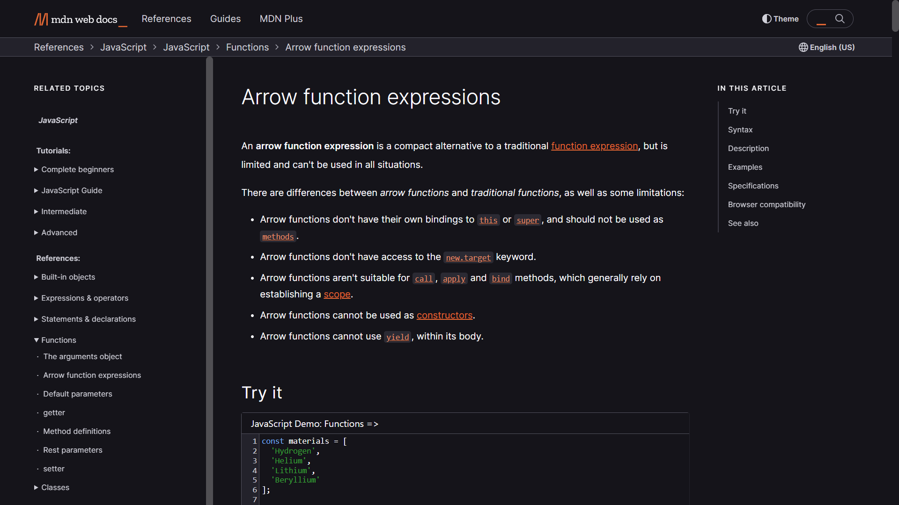

# JS Quick Refresher
## JS Summary


---
## Variables in JS

### Declaring variable with *var*
```js
var name = 'Madara';    // String
var age = 30;           // Integer
var EMS = true;         // Boolean
```

### Declaring variable with *let*
```js
let name = 'Madara';    // String
let age = 30;           // Integer
let EMS = true;         // Boolean
```

### Declaring variable with *const*
```js
const name = 'Madara';    // String
const age = 30;           // Integer
const EMS = true;         // Boolean
```

---
|       #        |  var   |    let     |   const    |
| :------------: | :----: | :--------: | :--------: |
|     scope      | global | code-block | code-block |
|    updation    |   ✔️    |     ✔️      |     ❌      |
| re-declaration |   ✔️    |     ❌      |     ❌      |

>For more info related to *var*, *let* and *const* click here 👇[](https://www.freecodecamp.org/news/var-let-and-const-whats-the-difference/)
---

## Functions in JS
```js
function summerizeShinobi(shinobiName, shinobiAge, KekkeiGenkai) {
  // parameters inside brackets have local-scope only
  return (
    "The Shinobi is " +
    shinobiName +
    ", age is " +
    shinobiAge +
    " & possess Kekkei Genkai " +
    KekkeiGenkai
  );
}

console.log(summerizeShinobi(name, age, EMS)); // this way we can directly prints of function's return value(s)
```
### Arrow functions
They work similar to traditinal functions but have important differences.

>Follow the documentations provided to know about *Arrow Function* in detail 👇[](https://developer.mozilla.org/en-US/docs/Web/JavaScript/Reference/Functions/Arrow_functions)
```js
const summerizeShinobi = (shinobiName, shinobiAge, KekkeiGenkai) => {
  // parameters inside brackets have local-scope only
  return (
    "The Shinobi is " +
    shinobiName +
    ", age is " +
    shinobiAge +
    " & possess Kekkei Genkai " +
    KekkeiGenkai
  );
};

console.log(summerizeShinobi(name, age, EMS)); // this way we can directly prints of function's return value(s)
```