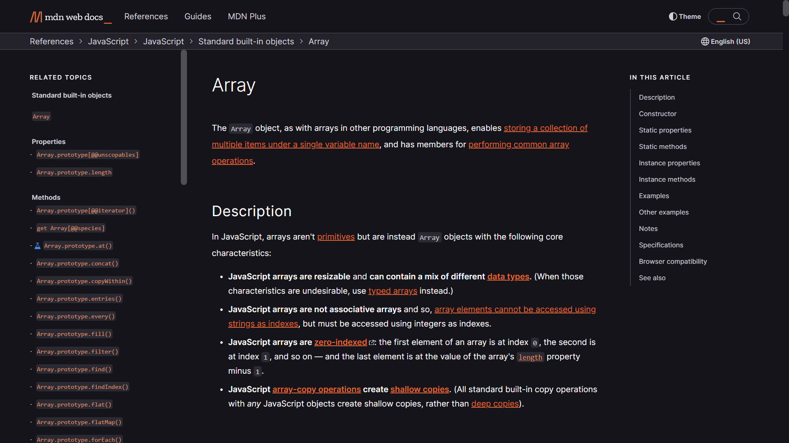

# Array
- The Array object, as with arrays in other programming languages, enables storing a collection of multiple items under a single variable name, and has members for performing common array operations.
- In JS, an array can store data of different datatypes (such as string, integer, boolean etc.)
```js
const arr = ['Yoriichi', 106, true, {name: 'Sakura', trash: true}];

// iterating through an array
for (let element of arr) {
  console.log(element);
}

// meathods 
console.log(arr.map(element => `element: ${element}`));
```
>For more methods & detailing on Array read this 👇 [](https://developer.mozilla.org/en-US/docs/Web/JavaScript/Reference/Global_Objects/Array)

- We can still edit `arr` array without violating the restriction for `const` to not to change! Here is the some example:
  - using `push()` method to edit `arr` array
  ```js
  arr.push({Chakra: 'Wind'});
  console.log(arr);
  ```
  - Here it the output, without any error for editing the constant!!
  ```js
  [
    'Yoriichi',
    106,
    { name: 'Sakura', trash: true },
    { Chakra: 'Wind' }
  ]
  ```
- Here is the reason for this. Reference type only stores an address pointing at place in memory where that array is stored
- And thus that pointer is not changed by adding an element, therefore the `const` value is not affected.

# Spread & Rest Operator
## Spread Operator(...)
**Spread Operator (...)** takes array/object after the operator, and pull out all the elements & properties and put it whatever around the operator

```js
const cpyArr = [arr]; // this would create a nested array instead of copy of it
const cpyArr = [...arr]; // yikes!! now it would create a true copy of array
```
## Rest Operator(...)
**Rest Operator (...)** is similar to spread operator, but it works in complete opposite scenerio. Here we don't take elements out of array, instead (...) are used when need to merge elements into array
```js
// this would return only 3 arguments in output
const displayArgs = (arg1, arg2, arg3) => {
    return [arg1, arg2, arg3];
}

console.log(displayArgs(1, 2, 3, 4));   // In this case, only first three agruments would be returned
```
```js
// this would return multiple arguments in output
const displayArgs = (...args) => {
    return args;
}

console.log(displayArgs(1, 2, 3, 4));   // In this case, all agruments would be returned
```