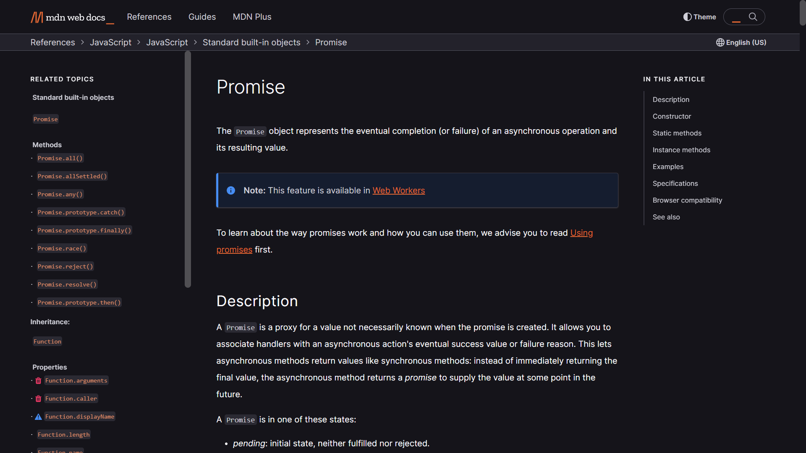

# Async & Promises
```js
setTimeout(() => {
    console.log("Timeout!!")
}, 2000);   // this is async code as it do not execute instantly
console.log("Hello");   // this is sync code as it execute instantly
```
Output:
```
Hello
Timeout!!
```
- JS do not block the code execution until async function is expired
- JS recogises the async function's callback i.e. the function would be called later, 2000 ms as in example, and immediately executes it when async is expired
- And that's why in example above, "Hello" is executed first (sync) after that "Timeout!!" (async)

>Go through the docs on Promise to understand it in better way 👇
[](https://developer.mozilla.org/en-US/docs/Web/JavaScript/Reference/Global_Objects/Promise)