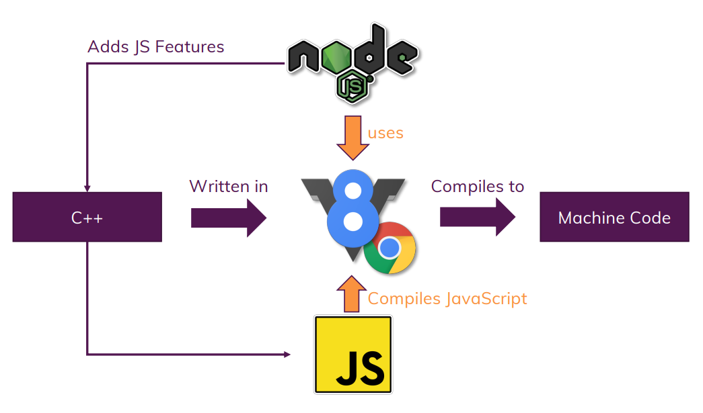
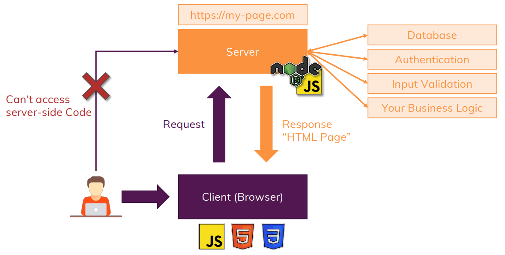
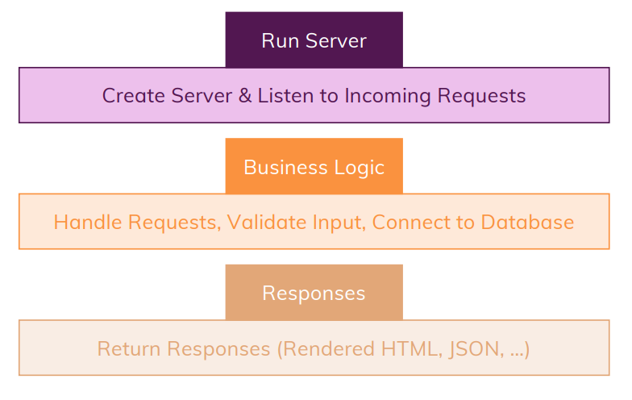

# What is *Node.js* ?
- node.js is JS runtime
- JS is programming language used in browser to manipulate DOM
- JS runs in the browser that help to interact that allows you to interact with the page after it is loaded, thus crucial for building interactive user interface in browser
- Node.js is built on JS to create more advance tasks that JS alone was not capable to do so
- Node.js allows to run "*JS on the Server*"
- The core takeaway is - *We use Node.js to run JS outside the browser*
- Node.js uses *V8*, JS engine built by Google, that runs JS in the browser
### Node js working

### JS on the Server

### Node.js Role
