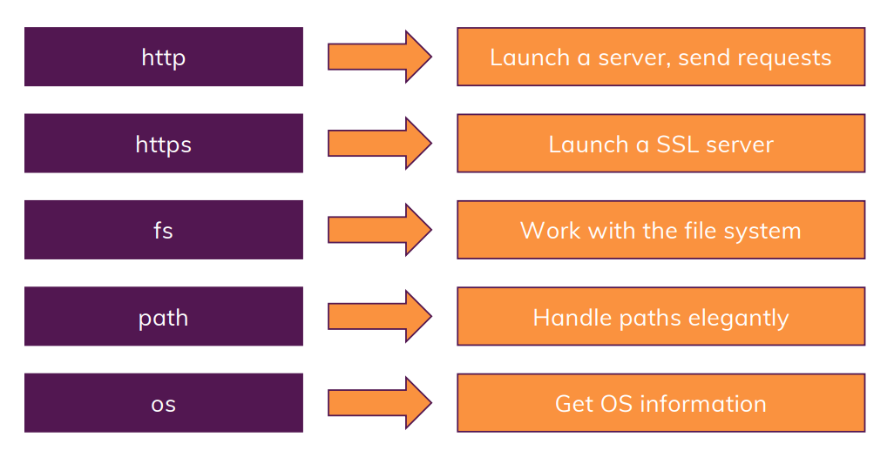
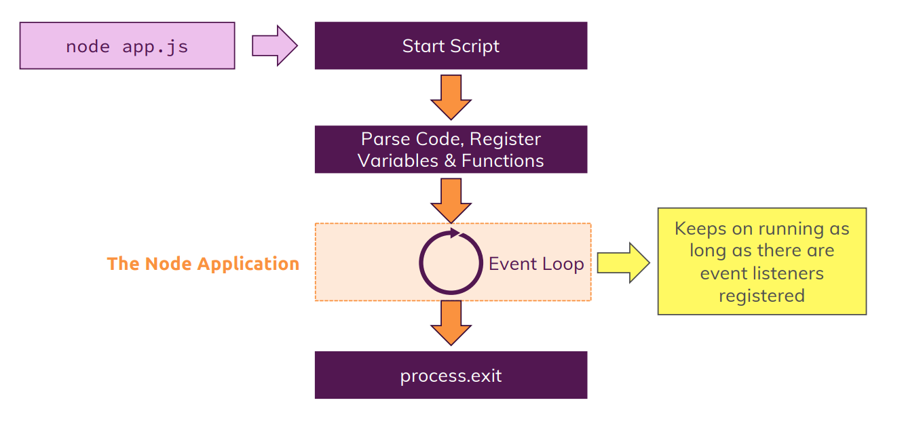
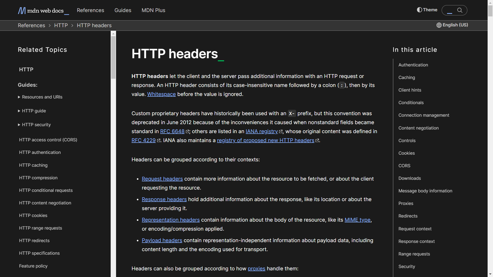

# Creating a Node Server
## Core Modules


## Creating server using core modules
```js
const http = require('http');   // the keyword 'require()' is used to import files 

// the method '.createServer' takes an request listener 
const server = http.createServer((req, res) => {    // here arrow function is used, but other type of fuctions can also be used
    console.log(req);
});

server.listen(3000);    // this would run Node.js scripts to listen at mentioned port number, and will not end immediately
```

## Node.js Program Lifecycle


>To know more about HTTP Header follow this 👇 [](https://developer.mozilla.org/en-US/docs/Web/HTTP/Headers)