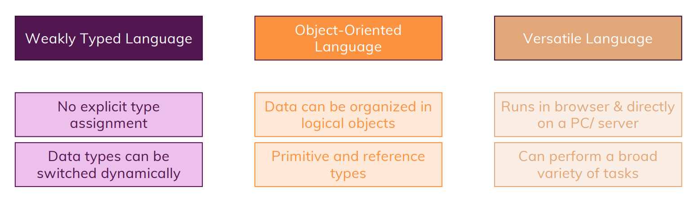

# JS Quick Refresher
## JS Summary


---
## Variables in JS
```js
var name = 'Madara';    // String
var age = 30;           // Integer
var EMS = true;         // Boolean
```

## Functions in JS
```js
function summerizeShinobi(shinobiName, shinobiAge, KekkeiGenkai) {
  // parameters inside brackets have local-scope only
  return (
    "The Shinobi is " +
    shinobiName +
    ", age is " +
    shinobiAge +
    " & possess Kekkei Genkai " +
    KekkeiGenkai
  );
}

console.log(summerizeShinobi(name, age, EMS)); // this way we can directly prints of function's return value(s)
```