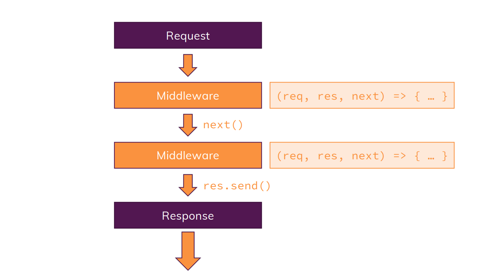

# What is Express.js
Express.js is a free and open-source web application framework for Node. js. It is used for designing and building web applications quickly and easily. Web applications are web apps that you can run on a web browser.

# Express.js is all about Middlewares



```js
const express = require('express');
const bodyParser = require('body-parser');

const app = express();  // running express as function

app.use(bodyParser.urlencoded({extended: false}));

app.use('/add-product', (req, res, next) => {
    res.send('<form action="/product" method="POST"><input type="text" name="title"><button type="submit">Add Product</button></form>');
});

app.post('/product', (req, res, next) => {
    console.log(req.body);
    res.redirect('/');
});

app.use('/', (req, res, next) => {
    res.send('<h1>This is created using Express meathod</h1>');
});

app.listen(3000);
```
- `use` allows us to add new middlware function
- `next()` allows to continue to the next middleware in line
- `listen()` allows to do both: create server and listen it to mentioned port
- we can omit the import of `http` as it is already handled by *express.js*
- Thus *express.js* reduces code length greatly
- *'/'* in `use` doesn't mean the path need to be exactly *'/'*, it actually means that path starting with *'/'*
- `'/product'` should be on the top of `'/'` as requests are handled in *top-to-down* way
- Using `next()` would throw an error as it would be too much response at a time!
>NOTE: The order of using path & using next or not, matters a lot.
- `use` would get trigger for both *get* & *post*, thus `get` & `post` are used for such cases!