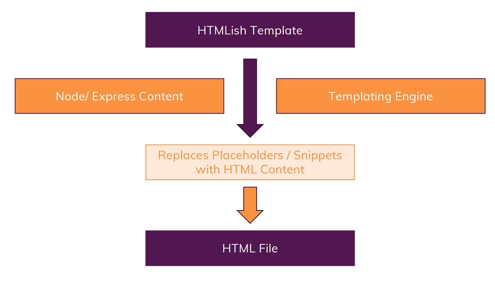

# Template Engine
- A *template engine* enables you to use static template files in your application.
- At runtime, the *template engine* replaces variables in a <u>template file</u> with <u>actual values</u>, and transforms the template into an HTML file sent to the client.
- This approach makes it easier to design an HTML page.
- Some popular *template engines* that work with Express are *Pug, Mustache, and EJS*.

# Working of Template Engine


# Insatlling some Template Engine
Here we would go through the 3 major template engines:
- EJS
- Pug
- Handlebars

Use the following to install all 3 at same time

```
npm install --save ejs pug express-handlebars
```