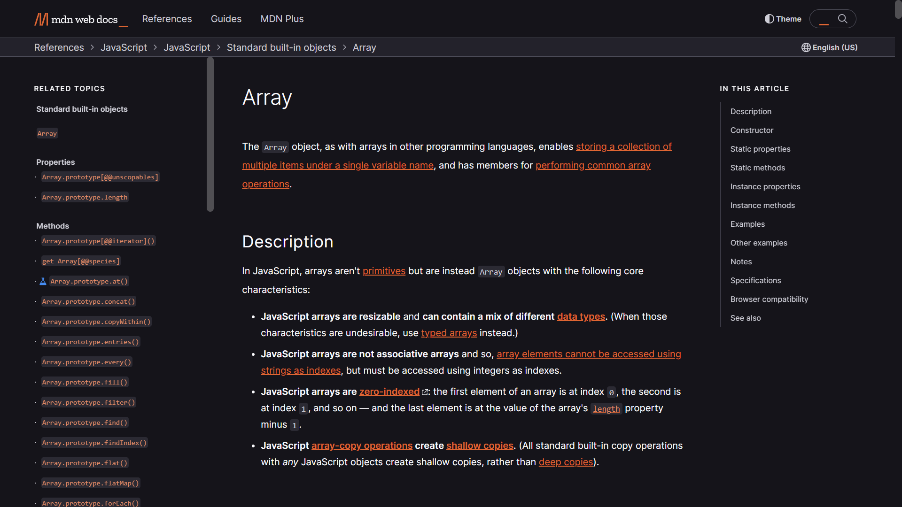

# Array
- The Array object, as with arrays in other programming languages, enables storing a collection of multiple items under a single variable name, and has members for performing common array operations.
- In JS, an array can store data of different datatypes (such as string, integer, boolean etc.)
```js
const arr = ['Yoriichi', 106, true, {name: 'Sakura', trash: true}];

// iterating through an array
for (let element of arr) {
  console.log(element);
}

// meathods 
console.log(arr.map(element => `element: ${element}`));
```
>For more methods & detailing on Array read this 👇 [](https://developer.mozilla.org/en-US/docs/Web/JavaScript/Reference/Global_Objects/Array)