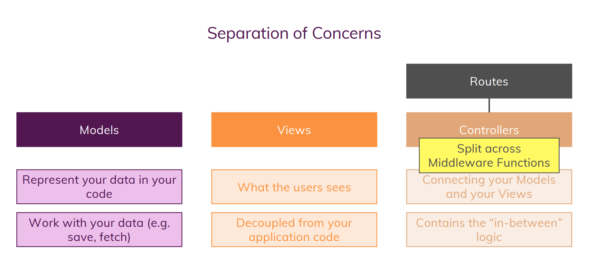
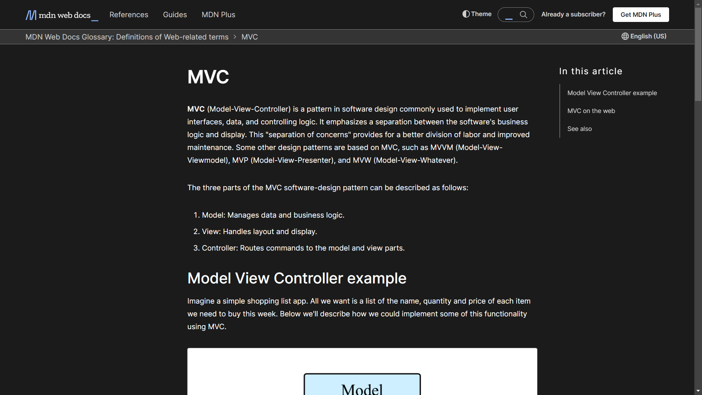

# What is MVC?
- *MVC (Model-View-Controller)* is a pattern in software design commonly used to implement user interfaces, data, and controlling logic.
- It emphasizes a separation between the software's business logic and display.
- This "separation of concerns" provides for a better division of labor and improved maintenance.

---

> For more detail follow up the Docs 👇 