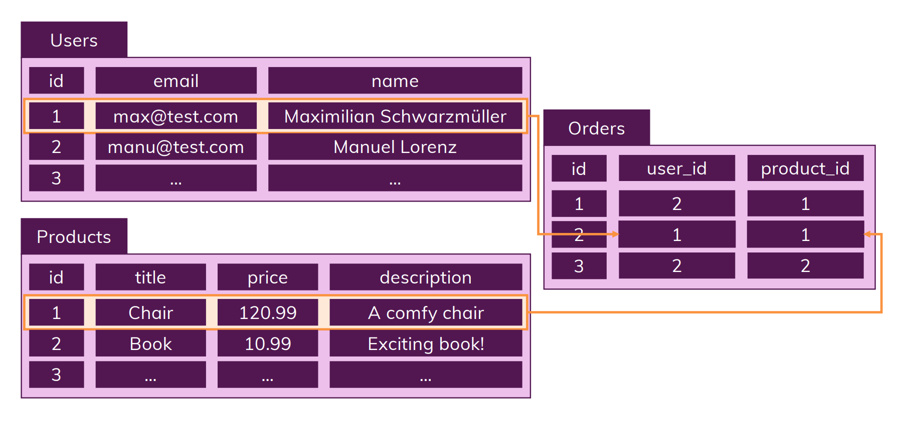

# What is SQL?
- SQL databases workes with *tables*
- In a table we may have various fields or columns, where we fill our data for these *fields* / *records*
- One of the key feature of SQL is that they allows to relate the tables

Here is a example to explain above points:

