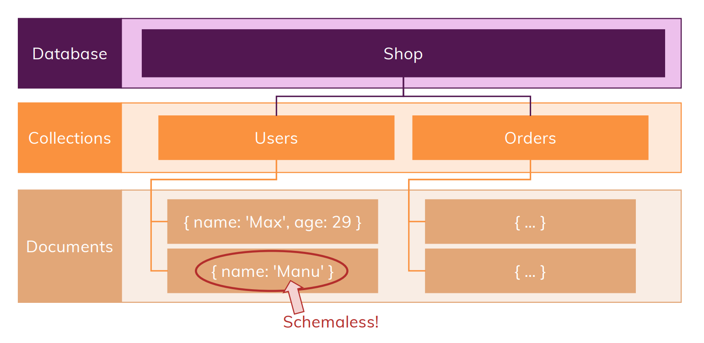
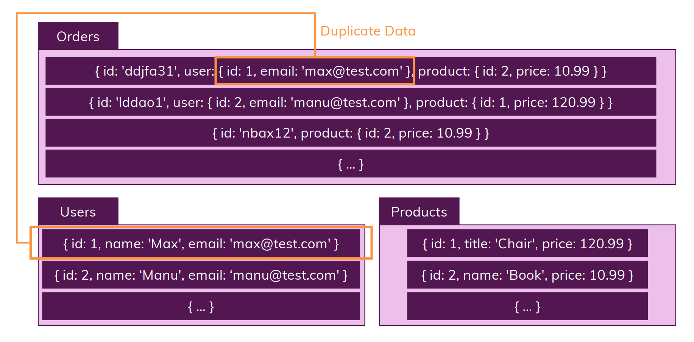

# What is NoSQL?
- The name itself reflects that it does not follow the approch SQL follows
- In NoSQL we have *Collections*, where we do not find *records* instead we find so-called *documents*
- One key feature of NoSQL is that, one can store multiple documents with different structures in same collection

- In NoSQL there is no thing like *relations*, instead we go for duplicate data

