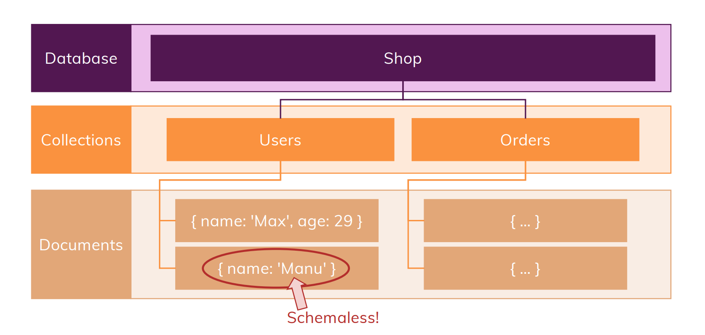

# What is Mongo DB?
- It is tool for running NoSQL DBs
- It can work with large amount of data
- It can quickly query, store & interact with data

# How it works
- Here we do not have tables, we have collections to deal with
- Inside of each collection again we do not have records that we used to have in SQL, instead we got documents
- The *document* in **MongoDB** may have *JSON* file
- It is schemaless, thus it provides flexiblity while dealing with databases

