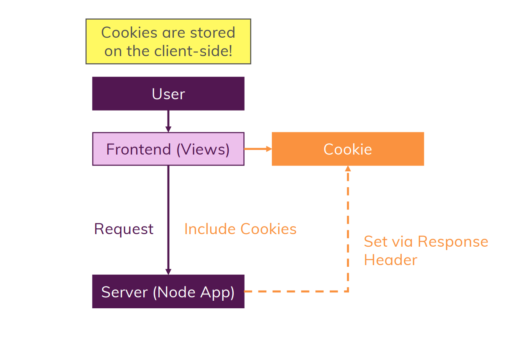
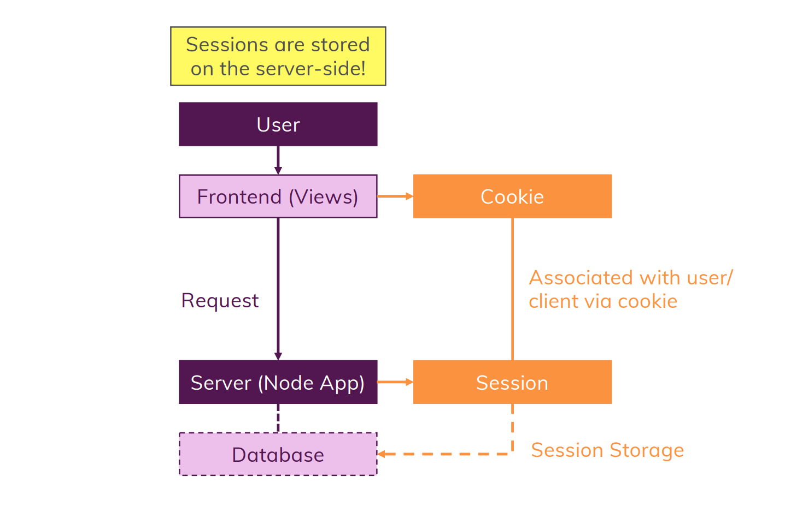

# What is a Cookie?
- To understand the concept of cookie, let us assume a situation where an authenticate user refreshed the page. Thus, a new request is generated.
- Without cookie after refreshing the user may loose all the data there
- So now we can say a cookie can store the some information that can be resused later, such as in case of refreshing a page without loosing data of it.
- It is created at client side

# What is Session?
- Now we know cookie stores some data that can be reused, but it would be a bad practice to store sensitive data, such as authentication tokens, in cookie as it might get manipulated by anyone
- Thus we need to store such data at backend, and in a such way that other users(if any) can't access such information of each other
- Here it comes the concept of Sessions, which is used for the same reasons

