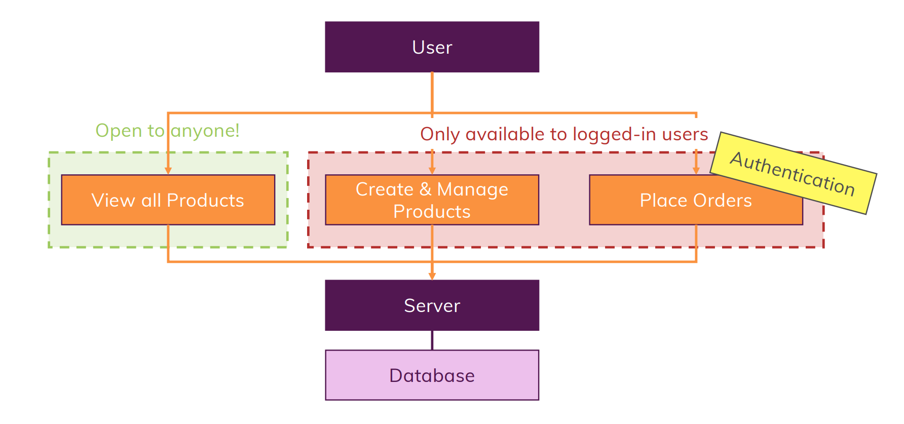
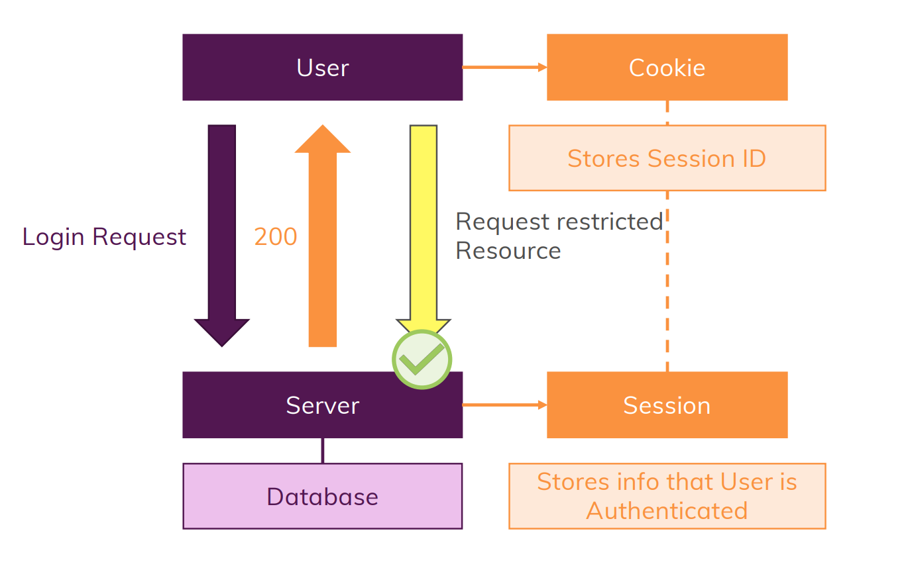

# What Authentication is really about?
- The term "Authentication" is not simply means verifing user's credentials
- It means to isolate the data corresponding to each user
- For ex. Orders of one user should not be accessed by any other user
- As we know using routes users can access views, create products & place orders etc.
- Here user doesn't means a logged in user, it simply means any person visiting our website
- So this anonymous user should be restricted to such crucial routes like placing orders, creating & manging products but it is safe to let this user some generalized routes like viewing all products

# How to implement Authentication?
- To get all access the person need to signup i.e. declare its own credentials into the user database
- Now this user would send a request with its credentials
- After verify the credential request user would receive 200 status i.e. successful login
- Meanwhile a session would be created at the server-side, which stores the user's login status & the session ID is stored at client-side as a cookie
- As long as user have this cookie this user could have full access

