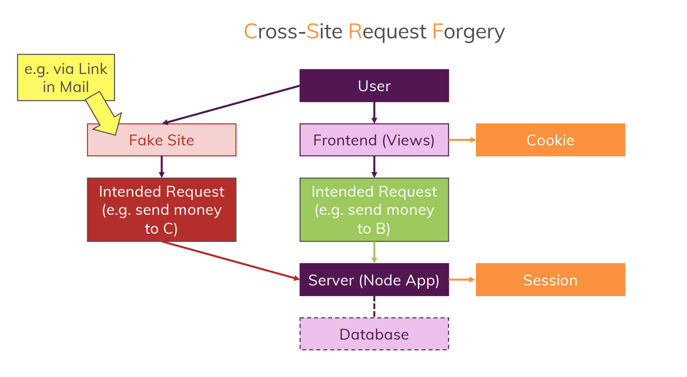

# **CSRF** (Cross-Site Request Forgery) **Attacks**
- This is special type of attack pattern where people can abuse & trick users of your applications to execute malicious code
- In this attack the *session* is targeted & stolen without user's awareness
- Once the *session* is stolen the hacker could  perform certain task that user may not want, such as transfer of money
- The entire attack is invisible for the user but it affects user in various threats



# How to avoid **CSRF Attacks**?
- The idea is, we need to ensure that people can only use your *session* if they are working with your *views*
- So that views is only rendered by your application, thus that session is not available on any fake page/site
- To implement this protection we would use *csrf token*


### To use those *csrf tokens* we would use a package called `csurf`

Installations of `csurf`
``` 
npm install --save csurf
```
- This is a package for node-express which allows to generate *csrf token*
- We would then include such *tokens* in our views and then on the server this package would check if does have a valid token
- New unique *token* is generated with every render, now the hacker can't access the views just from session & also it is secured by random hashed *token*