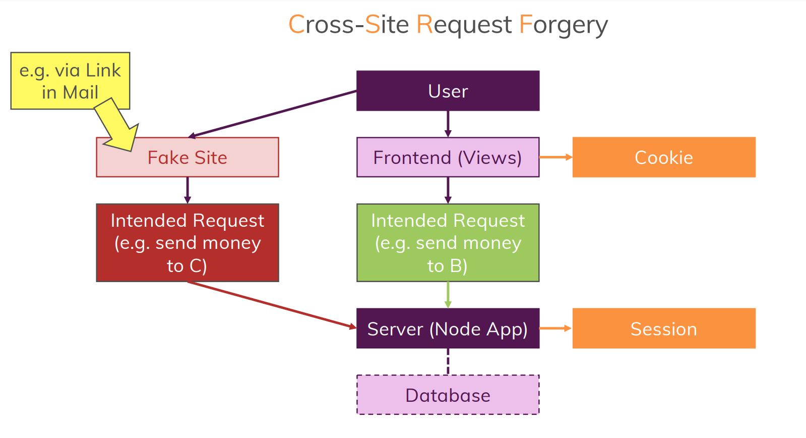

# CSRF Attacks
## What is CSRF Attack all about?
- CSRF stands for ***C**ross-**S**ite **R**equest **F**orgery*
- In this attack the session of the user is targetted & it may be misused by attacker to trick user to execute malicious code, such as interfering the payment system etc.
- This exposes the great threat to the application & its user's data, as the how process of malicious activites is in visible to user & the system logic could be easily fall for the trick



## How to protect system from such attacks?
- The solution to this is one must access  session only if has the view is rendered by client's side itself not by any fake site
- Thus we have another package called `CSURF`, which provides some tokens which can be embedded to the views for every requests that does some processing at backend that changes the state of the user
- At the server side this package checks if the incoming token (from the views) is valid or not

# Here is the implementation of it
## Installation
```
npm install --save csurf
```
## Implementing CSURF tokens to the *App*
- We would pass the generated csurf token as a middleware to every request
- But for validation we need a token in our views, thus we would embedd *CSURF token* as hidden input with *name="_csrf"*
- To make it happen we would use *locals*, a special field that are passed as a local variable to the rendered views

```js

...


const csrf = require('csurf');

const app = express(); // running express as function
const store = new MongoDBStore({
    uri: MONGODB_URI,
    collection: 'sessions',
});

// storing csurf token
const csrfProtect = csrf();

app.set('view engine', 'ejs'); 
app.set('views', 'views');

...

// passing tokens
app.use(csrfProtect);

app.use((req, res, next) => {
    if (!req.session.user) {
        return next();
    }
    User.findById(req.session.user._id)
        .then((user) => {
            req.user = user;
            next();
        })
        .catch((err) => {
            console.log(err);
        });
});

app.use((req, res, next) => {
    if (!req.session.user) {
        return next();
    }
    User.findById(req.session.user._id)
        .then((user) => {
            req.user = user;
            next();
        })
        .catch((err) => {
            console.log(err);
        });
});


// special field called "locals"
app.use((req, res, next) => {
    res.locals.isAuth = req.session.isLoggedIn;
    res.locals.csrfToken = req.csrfToken();
    next();
});

// utilizing the imported route(s)
app.use('/admin', adminRoutes); // '/admin' is used to filter url
app.use(shopRoutes);
app.use(authRoutes);

...

```

> at views
```hbs

...

        <!-- look at the unique name -->
        <input type="hidden" name="_csrf" value="<%= csrfToken %>">

...

```

