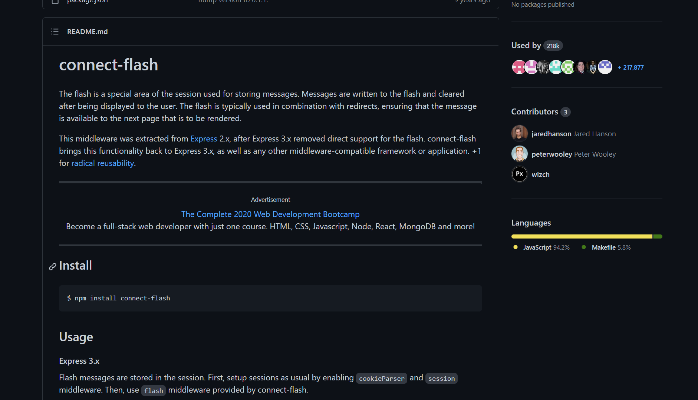

# Responding feedbacks
- The feedbacks are very essential to improve user experience especially in the case of error handling
- So we need these feedback along with session so they could be in sync with authentication
- But storing the error into the session is a bad idea & no of errors could pile up with the scale of the application
- Thus again we would utilize amazing package called `connect-flash`
- As name suggests it does not store errors it simply flashes it over error request and after that it got expired

```
npm install --save connect-flash
```

> for more follow the official docs: 👇
> [](https://github.com/jaredhanson/connect-flash)