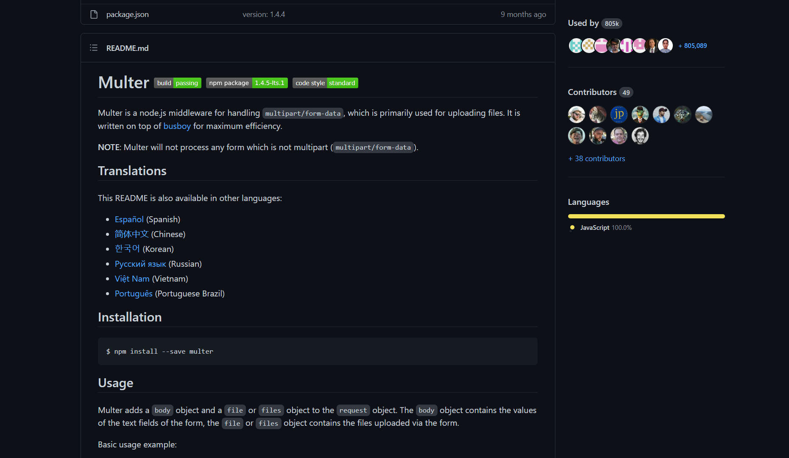

# File Upload / Download
- The major problem arises in adding file to backend that user can only add images from the one avialable on certain URL
- Here `Multer` comes into the picture, where files can be parsed through attribute

## Using Multer in this project
- Here we use to pick a file from user's machine
- Thus here we would do some changes in the form by define the type using `enctype` and setting it to `multipart/form-data`
> **NOTE**: by default `enctype` is set to `application/x-www-form-urlencoded` thus can't accept files
-

>For more info follow offical Docs 👇: 
